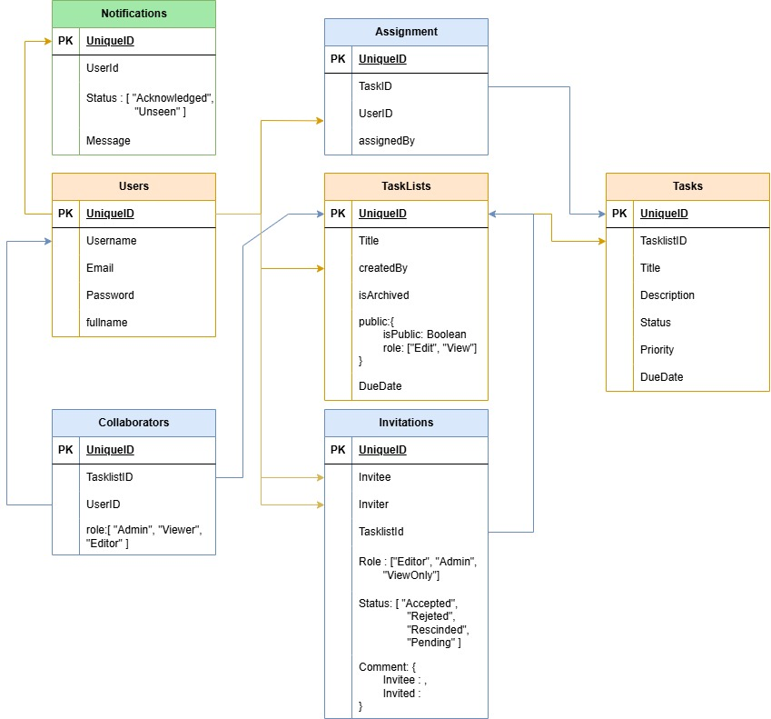

# SharedTasks - Task Management API

SharedTasks is a robust, scalable API designed to simplify task and project management for teams. With this API, teams can efficiently create, assign, and manage tasks while enforcing customizable role-based permissions, enabling seamless collaboration, and enhancing productivity across projects.

 > 20+ api endpoints, for all import postman collection from [./SharedTasks.postman_collection.json](./SharedTasks.postman_collection.json) 

---

## Key Features

### Task Management

- **Create & Organize Tasks**: Easily create tasks, set due dates, and categorize them by priority or status.
- **Track Task Progress**: Monitor the progress of tasks with customizable status options like "To Do", "In Progress", and "Completed".
- **Priority & Deadlines**: Assign priority levels and deadlines to ensure timely task completion.

### Collaboration & Role Management

- **Role-based Access Control (RBAC)**: Define roles such as "Admin", "Member", or "Viewer" for team members, controlling access and permissions across the platform.
- **Invite Collaborators**: Admins can invite users to join task lists, assigning them specific roles for collaboration.
- **Manage Permissions**: Different access levels ensure that only authorized users can modify, delete, or view specific tasks.

### Task Assignment & Tracking

- **Assign Tasks to Collaborators**: Assign tasks to specific team members and track their completion.
- **Unassign Tasks**: Easily unassign tasks to adapt to changing priorities and team dynamics.
- **Task Tracking by Assignee**: Monitor the progress of tasks by assignee to keep track of team members’ workload.

### Project Management

- **Organize Tasks into Task Lists**: Group tasks under organized task lists to manage projects and initiatives more effectively.
- **Public/Private Task Lists**: Control visibility by making task lists public for team-wide access or private for restricted users.
- **Permissions for Task Lists**: Admins can control who has access to each task list, with customizable settings for each role.

### Invitation & Access Control

- **Send Invitations**: Admins can invite users to join task lists and assign them roles.
- **Accept or Reject Invitations**: Collaborators can accept or reject invitations based on their availability or preference.
- **Track Invitation Status**: Track the status of invitations (pending, accepted, or rejected) to ensure smooth onboarding of team members.

### Real-Time Updates & Notifications

- **Stay Updated**: Receive real-time notifications on task assignments, status changes, and other important events.
- **Activity Logs**: Detailed logs provide insights into task updates, assignments, and permissions changes.

---

## Getting Started

### Prerequisites

- Node.js (v14 or higher)
- MongoDB (local or cloud instance)
- Git (for version control)

### Setup

1. **Clone the Repository**
   ```bash
   git clone https://github.com/The-Wee-Lad/SharedTasks-backend
   ```

2. **Install Dependencies**
   Navigate to the project folder and install dependencies:
   ```bash
   cd SharedTasks
   npm install
   ```

3. **Set up Environment Variables**
   Create a `.env` file in the root directory and configure the following:
   ```env
   MONGODB_URI=your_mongodb_connection_url
   JWT_SECRET=your_jwt_secret
   PORT=3000
   ```

4. **Run the Application Locally**
   To start the API server:
   ```bash
   npm start
   ```

5. **Access the API**
   The API will be accessible at `http://localhost:3000`.

---

## Database Schema

<details>
<summary><h3>Click to View Database Schema</h3></summary>

</details>

---

## API Endpoints
### User Authentication
- > POST /api/v1/user/register
- > POST /api/v1/user/login
- > POST /api/v1/user/logout
- > GET /api/v1/user/current
- > PATCH /api/v1/user/change-password
- > PATCH /api/v1/user/update-email
- > PATCH /api/v1/user/update-fullname
- > POST /api/v1/user/refresh
- > GET /api/v1/user/confirm/:confirmationToken
- > POST /api/v1/user/resend-confirmation

### TaskList
- > POST /api/v1/tasklist/create
- > GET /api/v1/tasklist/get/:tasklistId
- > GET /api/v1/tasklist/get
- > PATCH /api/v1/tasklist/update/:tasklistId
- > DELETE /api/v1/tasklist/delete/:tasklistId

### Task
- > POST /api/v1/task/create/:taskListId
- > GET /api/v1/task/get/:taskId
- > PATCH /api/v1/task/update/:taskId
- > DELETE `/api/v1/task/delete/:taskId
`
### System
- > GET `/api/v1/healthcheck`

### Invitation
- > POST `/api/v1/task/management/invite/create`
- > POST `/api/v1/task/management/invite/accept`
- > POST `/api/v1/task/management/invite/reject`
- > DELETE `/api/v1/task/management/invite/delete/:invitationId`
- > GET `/api/v1/task/management/invite/get-all`
- > GET `/api/v1/task/management/invite/get`

### Collaborator, Assignments & Notifications !!! 
 
 - #### Under Devolopment.

``` 20+ api endpoints, for all import postman collection from the folders! ```

---

## Contributing

We encourage contributions from the community! To contribute:

1. Fork the repository.
2. Create a new branch (`git checkout -b feature-branch`).
3. Commit your changes (`git commit -m 'Add feature'`).
4. Push to the branch (`git push origin feature-branch`).
5. Create a pull request.

---

## License

This project is licensed under the MIT License. See the [LICENSE](LICENSE) file for more details.

---
